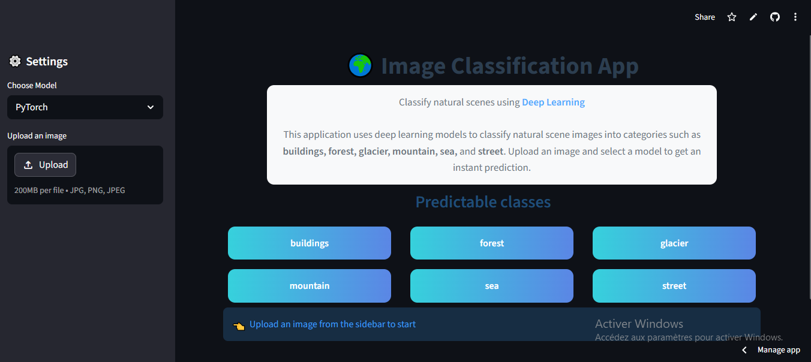
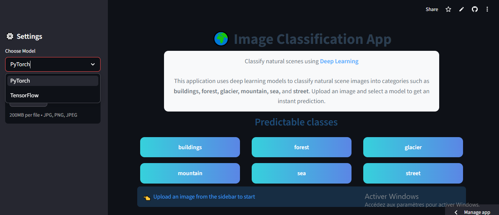
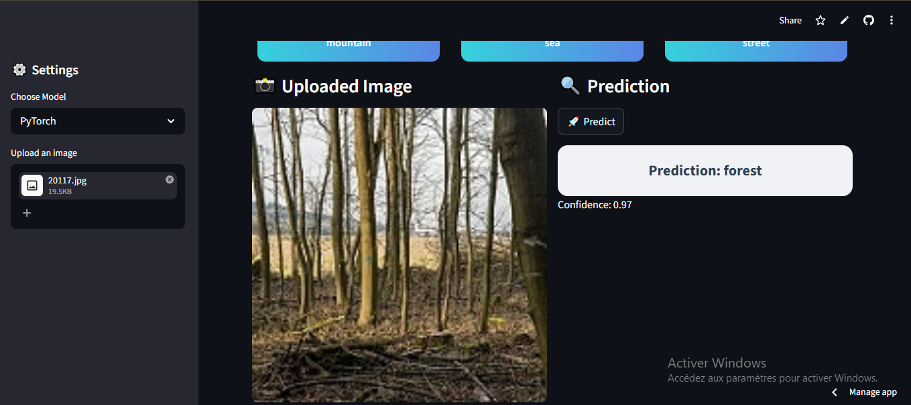
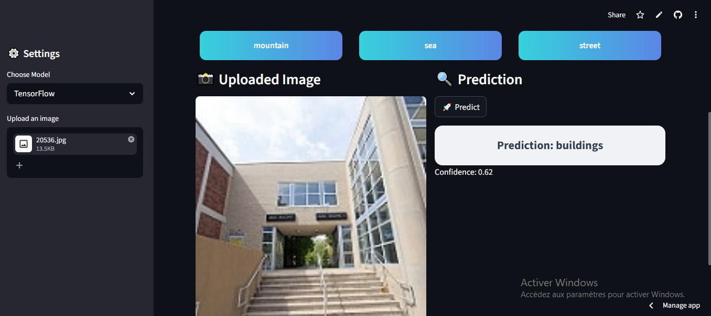

# Image Classification using Deep Learning (PyTorch & TensorFlow)

This repository implements a complete **image classification pipeline** for natural scenes using Deep Learning.

The goal is to classify images into 6 categories:

- Buildings 
- Forest  
- Glacier  
- Mountain  
- Sea  
- Street  

The project includes:
- CNN model built from scratch in **PyTorch**
- CNN model built using **TensorFlow**
- Training, evaluation, and prediction pipeline
- Web application (Streamlit)

---

# Dataset

The dataset used is the **Intel Image Classification Dataset**.

It contains approximately:
- 14,000 training images
- 3,000 test images

Images are 150x150 pixels and distributed into 6 classes:

```bash
{'buildings': 0,
'forest': 1,
'glacier': 2,
'mountain': 3,
'sea': 4,
'street': 5}
```

---

# Project Structure

```
project/
│
├── data/
│   ├── train/
│   └── test/
│
├── models/
│   ├── model_pytorch.py
│   └── model_tensorflow.py
│
├── saved_models/         
│   ├── ahmed_model.pth
│   └── ahmed_model.keras
│
├── utils/                
│   ├── data_loader.py
│   └── data_loader_tf.py
│
├── static/
│   └── style.css
│
├── templates/
│   └── index.html
│
├── app.py                
├── train.py               
├── predict.py             
├── requirements.txt     
└── README.md             
```

---


---

# Installation

1. **Create environment (optional):**

```bash
conda create --name cv_project python=3.11
```

2. **Activate environment:**

```bash
conda activate cv_project
```

3. **Install dependencies:**

```bash
pip install -r requirements.txt
```

# Usage

1. **Train the model**

- PyTorch
```bash
python train.py --framework pytorch
```

- Tensorflow
```bash
python train.py --framework tensorflow
```

2. **Make a prediction**

- PyTorch
```bash
python predict.py --framework pytorch --image_path path/to/image.jpg
```

- Tensorflow
```bash
python predict.py --framework tensorflow --image_path path/to/image.jpg
```

3. **Launch the web application**

- Streamlit (recommended)
```bash
streamlit run app.py
```

# Demo

- This section demonstrates the user interface of the application and the prediction results using both deep learning models.
- The system allows users to:

- Upload an image
- Select a model (PyTorch or TensorFlow)
- View real-time classification results

1. **Application Interface**
<p align="center">  </p>

2. Model Selection

- Users can choose between the two implemented deep learning models:

- PyTorch CNN model
- TensorFlow CNN model
<p align="center">  </p>

3. PyTorch Prediction
- Image uploaded
- Model processes input
- Predicted class displayed
<p align="center">  </p>

4. TensorFlow Prediction
- Image uploaded
- Model processes input
- Predicted class displayed
<p align="center">  </p>

# **Live Demo**
[Click here to try the app]([https://ton-lien-de-deploiement.com](https://computervisionintel-image-classification-btdnpkj8jy3auu8q2teag.streamlit.app/))

